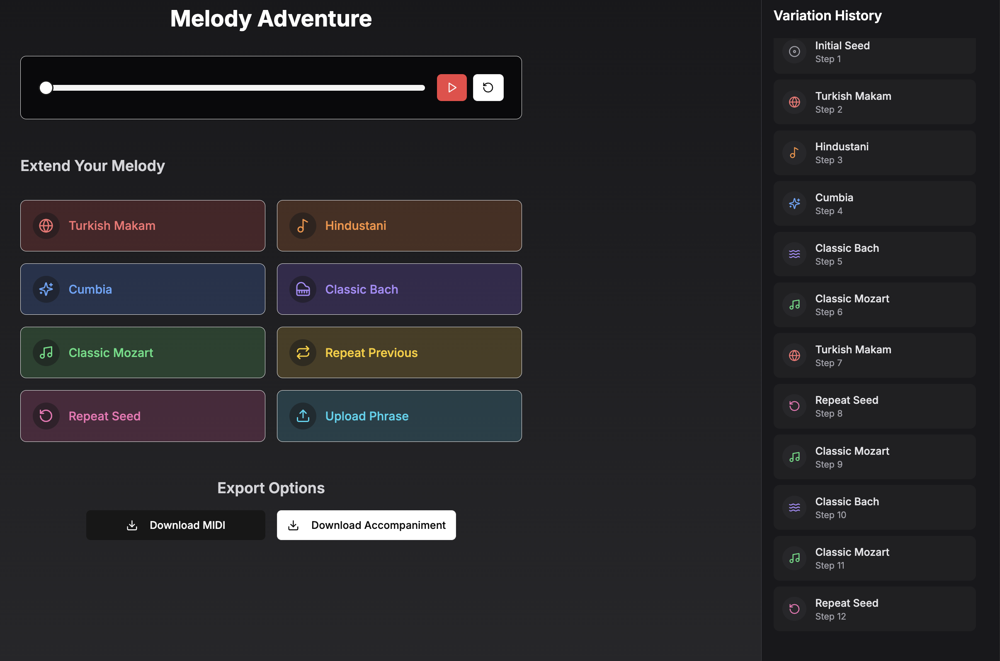

# balkon

Repo for team "Balkon" project as part of the [Generative AI Music Workshop](https://www.upf.edu/web/mtg/generative-music-ai-workshop)

See these slides for more information: [Google Slides](https://docs.google.com/presentation/d/1WrLXe_GgY0DBO0b68IxigkbiwafrCIVx3zbgE7jamcg/edit#slide=id.p)



## Team members

- [Kevin Dela Rosa](https://linktr.ee/kdrwins)
- [Sercan Atlı](https://www.linkedin.com/in/hsercanatli/)
- [Vivek Vijayan](http://linkedin.com/in/vivek-vijayan12)

## Directory structure

```text
.
├── demo-melody-adventure/         # prototype app of the melody choose your own adventure
├── initial-experiment-notebooks/  # scratchpad notebooks for initial experiments
├── submodules/                    # submodules for the project, used for getting training data for Turkish Makam melody generation model
```
